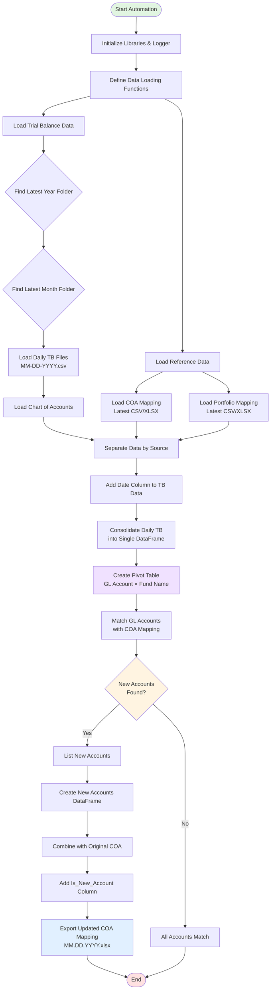
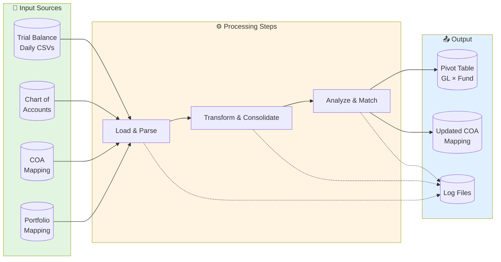
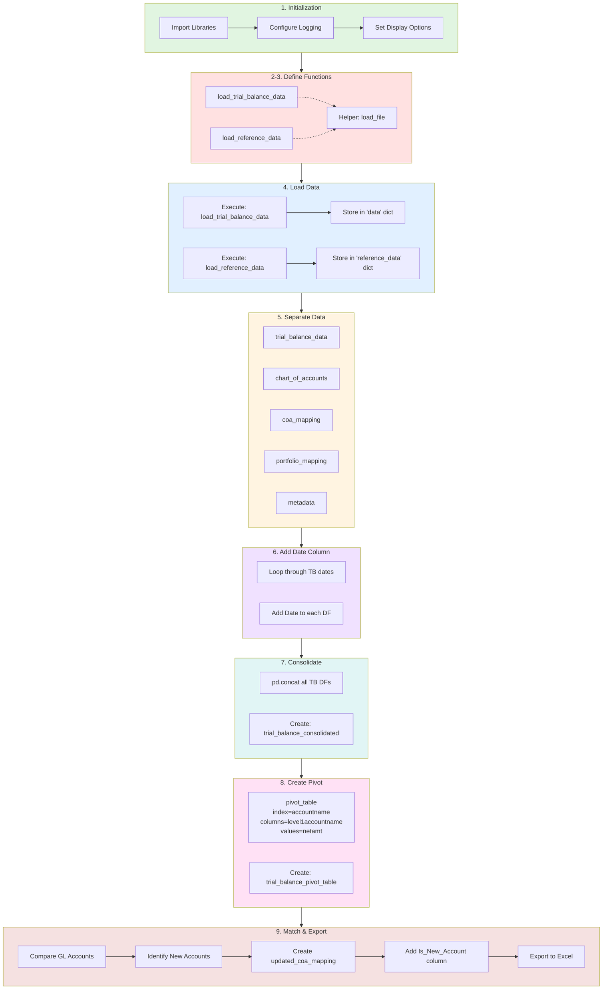
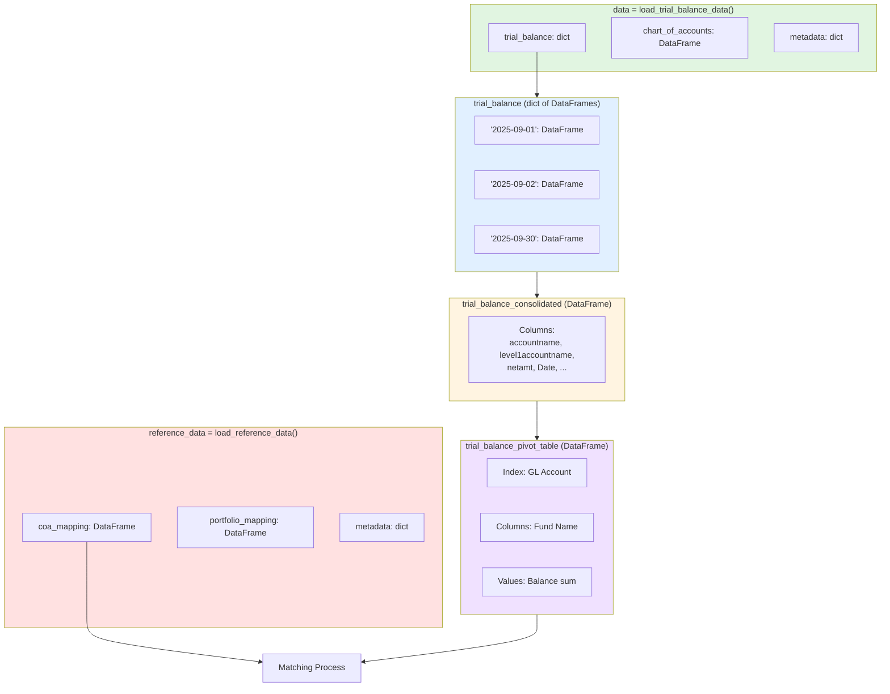
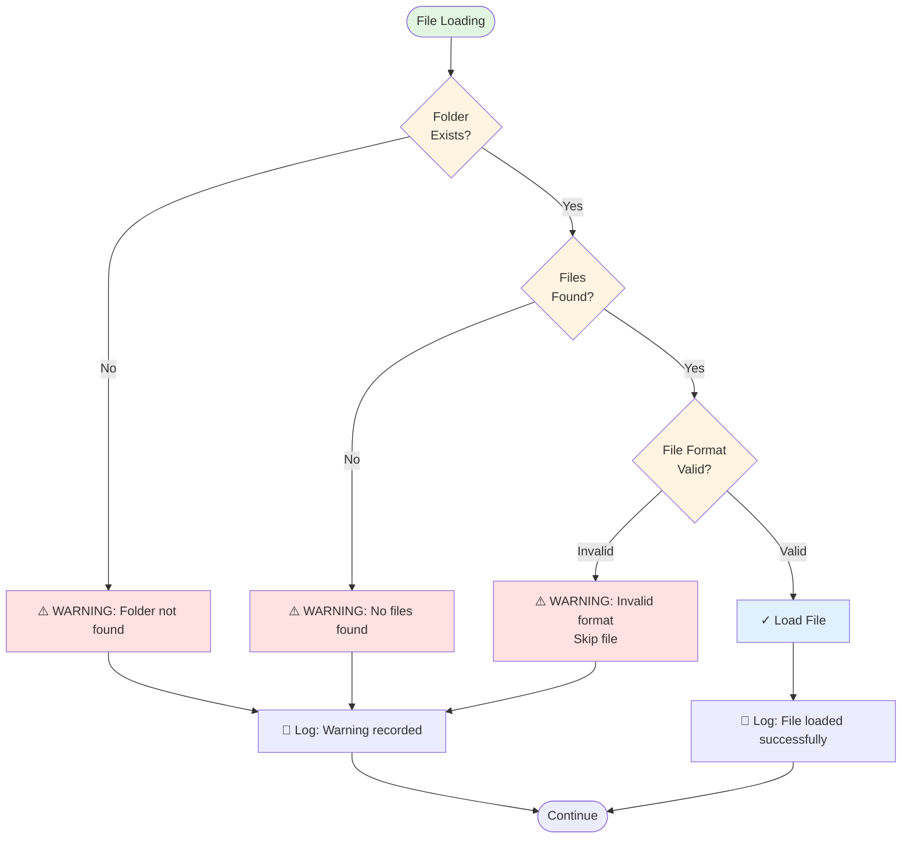

# Trial Balance Automation - Workflow Diagram

## Overview
This document provides a visual representation of the Trial Balance Automation workflow, from data loading to export.

---

## Main Workflow

---

## Data Flow Diagram

---

## Detailed Process Flow

---

## Data Structures

---

## Error Handling & Validation

---

## Usage Instructions

### Viewing the Diagrams

To view these Mermaid diagrams in VS Code, install one of these extensions:

1. **Markdown Preview Mermaid Support** (Recommended)
   - Extension ID: `bierner.markdown-mermaid`
   - Preview this file with `Ctrl+Shift+V`

2. **Mermaid Chart** (Official)
   - Extension ID: `mermaidchart.vscode-mermaid-chart`
   - Enhanced editing features

3. **Mermaid Preview**
   - Extension ID: `vstirbu.vscode-mermaid-preview`
   - Live preview capability

### Exporting Diagrams

1. **As PNG/SVG**: Use Mermaid Chart extension or online editor (mermaid.live)
2. **In Documentation**: These diagrams work in GitHub, GitLab, and most markdown viewers
3. **In Presentations**: Export as images or use reveal.js with mermaid plugin

---

## Diagram Legend

- 🟢 **Green boxes**: Start/Input points
- 🔵 **Blue boxes**: Processing steps
- 🟡 **Yellow boxes**: Decision points
- 🔴 **Red boxes**: End/Output points
- 🟣 **Purple boxes**: Data transformations
- **Dashed arrows**: Logging/metadata flow
- **Solid arrows**: Data flow

---

**Last Updated**: November 11, 2025  
**Author**: Raiden Velarde Guillergan - Data Scientist
